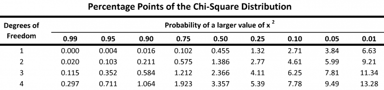

```{r sampling}
#| include: false
library(exams)
library(exams2forms)
UKDemographic <- read.csv("~/../../Downloads/UKDemographic.csv", stringsAsFactors = T, na.strings = "")
data_chisq = chisq.test(table(UKDemographic$Sex))
```

Question
========
1. **What is the chi-squared value for the observed proportion of females and males in the UKDemographic dataset relative to that expected under the null hypothesis?**

::: {style="padding-left: 2em;"}
`r add_cloze(data_chisq[["statistic"]][["X-squared"]])`
:::

2. **How does the observed proportion of females and males in the UKDemographic dataset differ from that expected under the null hypothesis? Fill in the blanks:**

::: {style="padding-left: 2em;"}
There are `r add_cloze("more", c("less", "more"))` females than expected under the null hypothesis in the UK Demographic dataset.
:::

3. **What is the probability of observing this difference between female and male proportions, if the true population proportion was 50:50? NOTE: By default, it says in the summary that the p-value is < 2.2e-16, to access the actual p-value, use `chisq.test(table(UKDemographic$Sex))[["p.value"]]`.**

::: {style="padding-left: 2em;"}
`r add_cloze("2.702179e-21", type = "string")`
:::

4. **Should we be inclined to accept or reject the null-hypothesis? Fill in the blanks below:**

::: {style="padding-left: 2em;"}
As the p-value is `r add_cloze("less than", c("less than", "greater than"))` 0.05, the chi-squared analysis suggests that it is extremely `r add_cloze("unlikely", c("likely", "unlikely"))` that we would have observed as big of a difference in the ratio of males and females as expected under the null hypothesis of equal numbers. Therefore, we should be inclined to `r add_cloze("reject", c("accept", "reject"))` the null hypothesis.
:::

5. **What might explain the difference between the observed proportion of females and males in the UKDemographic dataset relative to that expected under the null hypothesis?**

```{r table2}
#| echo: false
ans <- character(4)
sol <- logical(4)

ans[1] <- "Young children could have been accompanied by a parent, that happened more often to be their mother, who also took part."
sol[1] <- TRUE

ans[2] <- "The population could have been sampled from a particular sex-biased profession, e.g. hospitals"
sol[2] <- TRUE

sol[3] <- TRUE
ans[3] <- "The absolute frequency of males:females is not 1:1 in the general population, there are more females so this could be reflective of the true population"

sol[4] <- TRUE
ans[4] <- "Males are at greater risk of death throughout postnatal life, and in the UK the sex ratio is about equal at 50 years of age, and by age 90, there are twice as many females"
```

::: {style="padding-left: 2em;"}
`r add_cloze(setNames(sol, ans), type = "mchoice")`
:::

`r format_metainfo("answerlist")`


Solution
========
Let's look at the output of the chi-sq test to see where the information is coming from.
```{r fart}
chisq.test(table(UKDemographic$Sex))
```

For question 1, the chi-squared value is our `X-squared` statistic, so this values is just `r data_chisq[["statistic"]][["X-squared"]]`. What does this value actually mean? Let's look at the chi-square table.

```{r graph}
#| echo: false

```

Our degrees of freedom is n-1, now because we only have two factors (male or female) this means it n = 2, so the degrees of freedom is 1. 

If we look along the degrees of freedom at 1, we compare our chi-squared value with the values in here. Our value of `r data_chisq[["statistic"]][["X-squared"]]` is much higher than the values on the table - so our probability of observing this value is well below 0.01 - so this is a very significant result.

Let's imagine the chi-squared value was 1, then we would see on the table that this value would sit between a probability value of 0.50-0.25, which is not significant.

The exact value of the probability value is also given in the summary table for the chi-sq test we do in r, and this value is `r data_chisq[["p.value"]]`. 

From the barplots and the boxplots we have created, we can see that there are more females than males in the dataset.

So, based on these results we can reject the null hypothesis that the proportion of females and males in the sample is equal, and say that it is extremely unlikely that we would have observed as big of a difference in the ratio of males and females as expected under the null hypothesis of equal numbers. 

For a reason why the observed proportion of females and males is different to that expected under the null hypothesis, all of the options are valid - whenever you have a statistical result, try to think of possible reason as to why the data may be reflecting this way.

Metainformation
===============
exname: penguins sex dimorphism
extype: cloze
exclozetype: `r format_metainfo("type")`
exsolution: `r format_metainfo("solution")`
extol: `r format_metainfo("tolerance")`
exshuffle: TRUE
